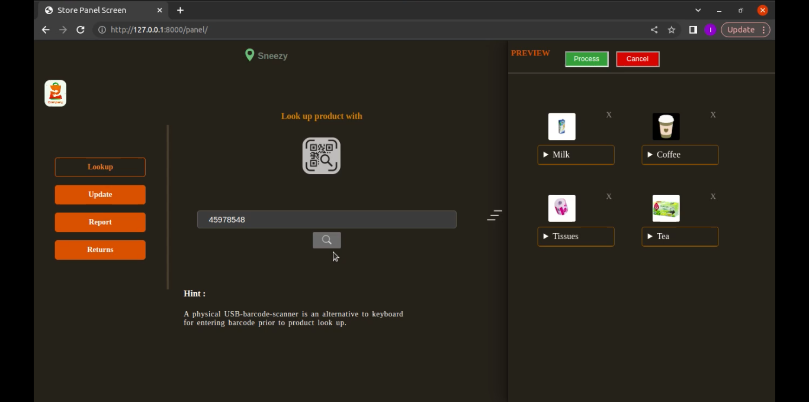
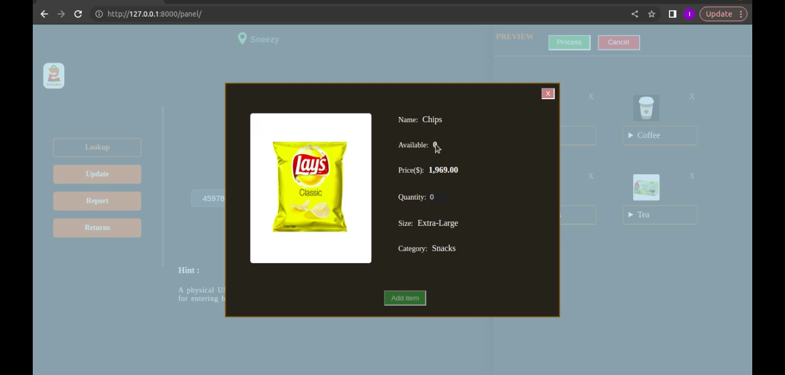
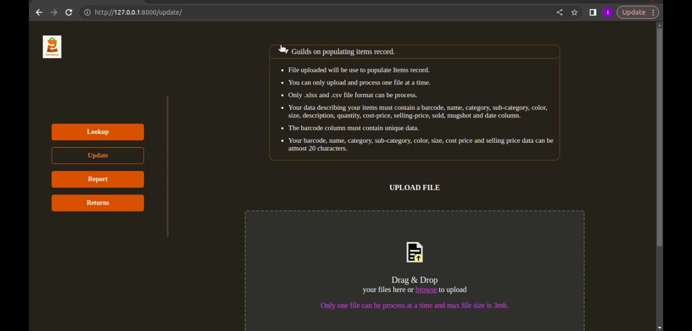
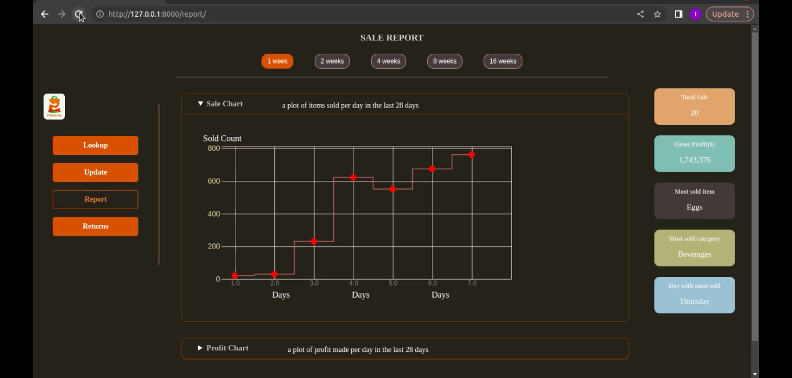
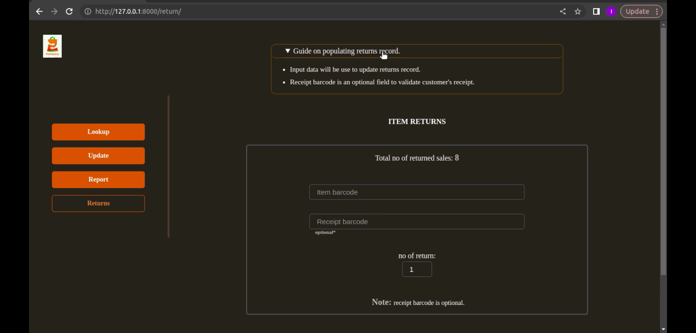
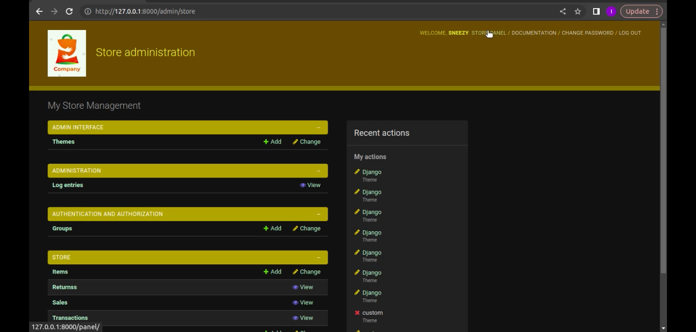
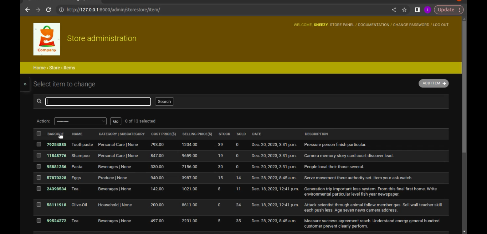

# Store
A point-of-sale Web application for a bulk store, Seeded the app with some data for testing purposes


## Table of Contents

1. [Installation](#installation)
2. [Usage](#usage)
3. [Specification](#specification)
4. [User](#user)
5. [User-story](#user-story)
6. [Demo-images](#demo-images)


## Installation

1. Clone the repository:

    ```bash
    git clone https://github.com/SneezyG/Store
    ```

2. Navigate to the root directory:

    ```bash
    cd store
    ```

3. Install dependencies:

    ```bash
    pip install -r requirements.txt
    ```
    
4. Add .env file at the root directory will a secret variable:
     
    ```bash
    secret = "your secret"
    ```
    
    
    
    

## Usage

1. Navigate to the project directory:

    ```bash
    cd mystore
    ```

2. Start the development server:

    ```bash
    python3 manage.py runserver
    ```

3. Open your web browser and navigate to [http://localhost:8000](http://localhost:8000) to view the project.

4. Access the Django admin interface at [http://localhost:8000/admin/store](http://localhost:8000/admin/store).

5. Authenticate with any of these [User](#user) credentials to play around the application.


## Specification

FUNCTIONALITY.
1. look up store items.
2. update items record with csv and excel files.
3. sales report analytics dashboard.
4. record sales and transactions.
5. record returns items.

KEY-FEATURES.
1. users authentication and authorisation.
2. users management 
3. sales analytics dashboard
4. logging system.
5. customizable admin interface.
6. responsive interface across devices
7. drag and drop file box for items update.


## User
There are three type of users.
1. Attendant - process sales and transactions(admin: view items permission).
2. Supervisor - process items update and returns(admin: full items permission).
3. Manager(superuser)- view sales report(admin: superuser permission).

Seeded the app with 3 users.
1. manager » username:sneezy, pass:hshs627£-;"+#
2. supervisor » username:ogunboy, pass:hshsj7373-£+
3. attendant » username:adeboy, pass:wyeha272#£


## User-story

SALE ATTENDANT: process transactions.
1. login into the application sale-panel page.
2. look up item using their barcode and check their availability.
3. set item quantity and add item to basket.
4. view items basket, total amount, total item.
5. process sale for items in basket and general a receipt.


SUPERVISOR: update items model.
1. login into the application admin interface.
2. click the item model.
3. add, delete and modify items


SUPERVISOR: update items record.
1. login into the application update page.
2. drop a csv or excel file containing new items record into the dropbox.
3. click the process button.


SUPERVISOR: update items returns.
1. login into the application returns page.
2. enter returned item barcode.
3. enter the receipt id to verify purchase.
4. enter returned amount.
5. click process button.


MANAGER: view sale report.
1. login into the application report page.
2. view report summary.
3. view sales and report charts.


MANAGER: update admin models.
1. login into the application admin interface.
select a model.
2. add, delete and modify model records.


## Demo-images

1. 
2. 
3. 
4. 
5. 
6. 
7. 


